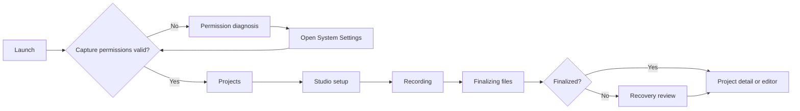

# Studio Recorder product model and app flow

## Product model

The current UI mixes navigation, capture configuration, layout concepts, and recovery into peer destinations. The redesigned model makes the durable object — a **Project** — the center of the app.

- **Project:** a recoverable `.recordingproject` package containing manifest, journal, raw tracks, and later edits/exports.
- **Session:** the period between starting and stopping capture.
- **Source:** one display, microphone, system-audio feed, or camera track.
- **Layout:** non-destructive composition instructions; it never changes raw tracks.
- **Export:** a derived output created from project media and edits.
- **Recovery:** a project state, not a permanent workspace.

## Information architecture

### Main window

1. **Projects** — launch point, recent recordings, interrupted-project notice, search.
2. **Studio** — capture setup, live preview, source health, record/stop.

### Contextual surfaces

- **Project Editor** — opens a selected project and keeps the project list available.
- **Recovery** — appears only when the journal indicates an interrupted project.
- **Settings** — a separate compact preferences window opened from `⌘,`.
- **Permission onboarding** — a single first-launch/repair sheet, not a tour.

## Primary journey

## Screen contracts

### 1. Permission diagnosis

Purpose: explain why capture cannot start and provide the exact repair action.

- Screen Recording: required.
- Microphone: required by the current capture contract.
- Camera: optional, permission-aware, previewed live, and written as an independent recoverable raw track.
- Recheck permissions automatically when the app becomes active.
- Never leave the main screen stuck on “Checking capture access…” without a route forward.

### 2. Projects

Purpose: orient the user around actual recording packages.

- One recent project receives a larger preview.
- Remaining projects use compact rows, not a tile dashboard.
- The primary action is `New Recording` (`⌘N`).
- Interrupted recordings surface as a contextual banner and Recovery badge.
- Until project indexing is implemented, the first SwiftUI slice can show only the latest completed path and interrupted packages.

### 3. Studio — ready

Purpose: answer four questions before recording:

1. What will be captured?
2. What will the viewer see?
3. Is audio arriving?
4. Where will files be written, and is there enough space?

The stage is the dominant region. Source selection and output contract live in the right inspector. The bottom control deck contains storage estimate, audio confidence, and one Record action.

### 4. Studio — recording

Purpose: provide confidence, not configuration.

- Lock source toggles.
- Show timer, dropped-frame/source health, disk headroom, and journal activity.
- Keep Stop (`⌘R`) unambiguous.
- Do not expose layout or advanced settings that cannot safely change mid-session.

### 5. Finalizing

Purpose: acknowledge that media files need to close cleanly.

- Keep the last preview frame.
- Replace Stop with `Finalizing 2 tracks…` and per-track completion.
- Disable closing only when absolutely necessary; explain why.
- On timeout or failure, route to Recovery with project context preserved.

### 6. Project Editor — composition foundation implemented

Purpose: compose and trim without modifying raw files.

- Preview above, timeline below, inspector right.
- Current foundation: one program timeline, trim-before/after, split/delete, undo/redo/reset, persisted `edit.json`, moving screen/camera composition, and MOV/PNG/GIF export.
- Layout and camera keyframes change the program output only.
- Transcript sentences map to token timestamps; cuts become non-destructive timeline ranges.
- Export is explicit. Streaming remains a later output target, not part of the capture MVP.

### 7. Recovery

Purpose: show exactly what survived.

- Summarize project creation time, selected displays, and last journal event.
- Mark each track as finalized, partial, or missing.
- Primary action opens the recovered project; destructive discard is secondary and confirmed.
- Empty Recovery state removes the destination from navigation.

## Current code boundary

| Capability | Current status | Design treatment |
| --- | --- | --- |
| Display discovery | Implemented | First-class source rows |
| Multi-display raw capture | Implemented | Track/source health during recording |
| System audio + microphone | Implemented in primary capture | Separate visible source confidence rows |
| 1080p-adaptive, 30 fps profile | Implemented | Compact output contract in inspector |
| Project package + journal | Implemented | Project-centric UX and finalizing status |
| Interrupted-project discovery | Implemented | Contextual Recovery flow |
| Camera isolation | Implemented | Selected device freezes into the Capture Request and writes `raw-tracks/camera.mov` |
| Canvas + fixed capture region | Implemented foundation | Horizontal/vertical/16:10/square/custom canvas; fixed region maps to ScreenCaptureKit `sourceRect` and selected output size |
| Source presentation intent | Implemented | Live screen/camera shape, scale, and placement freeze into the Capture Request, remain editable in Project layout, and render through the program compositor |
| Camera background | Implemented | Off, local Person segmentation, and adjustable green/blue chroma key persist with the scene and render without altering the raw camera track |
| Cursor treatment | Implemented foundation | Native cursor/click telemetry is recorded; Follow Cursor replays through Project playback/export while raw full-display media stays recoverable |
| Quick edit foundation | Implemented | Versioned `edit.json`; raw tracks stay unchanged while playback/export render ordered source ranges |
| Program compositor | Implemented on playback/export | Core Image compositor renders canvas, screen, camera shape/placement/mirroring, cuts, PNG, GIF, and MOV while raw tracks stay independent |
| Transcript editing | Not implemented | Target-state Editor only |
| RTMPS streaming | Implemented foundation | Record, YouTube Stream, or both reuse the frozen Scene; manual key stays in Keychain, while real ingest/reconnect soak remains before release readiness |

## Recommended SwiftUI implementation order

1. Replace indefinite permission state with the permission diagnosis screen.
2. Rebuild Studio as stage + inspector + control deck while keeping the existing `RecordingCoordinator` contract.
3. Add finalizing progress and clear failure-to-Recovery routing.
4. Add a minimal Projects view backed by `.recordingproject` package discovery.
5. ~~Seed Project layout state from the frozen Canvas & Framing contract and make it editable without changing raw tracks.~~ Implemented in versioned `edit.json`.
6. Add cursor telemetry/follow-mode rendering, then transcript editing and richer exports.
