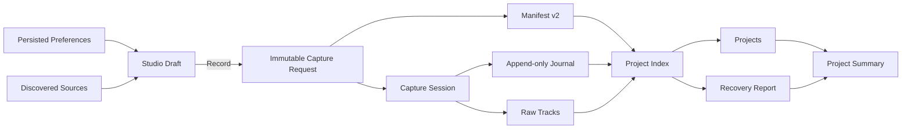
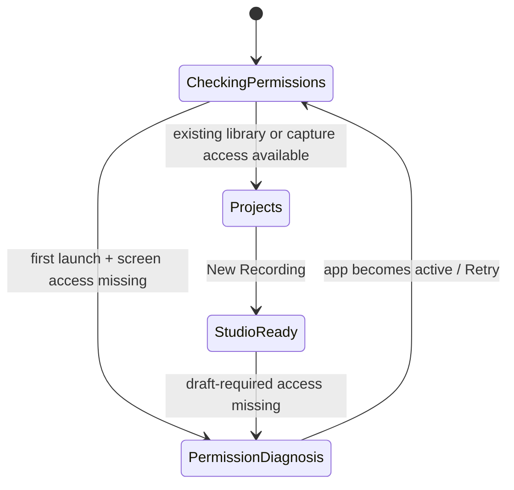
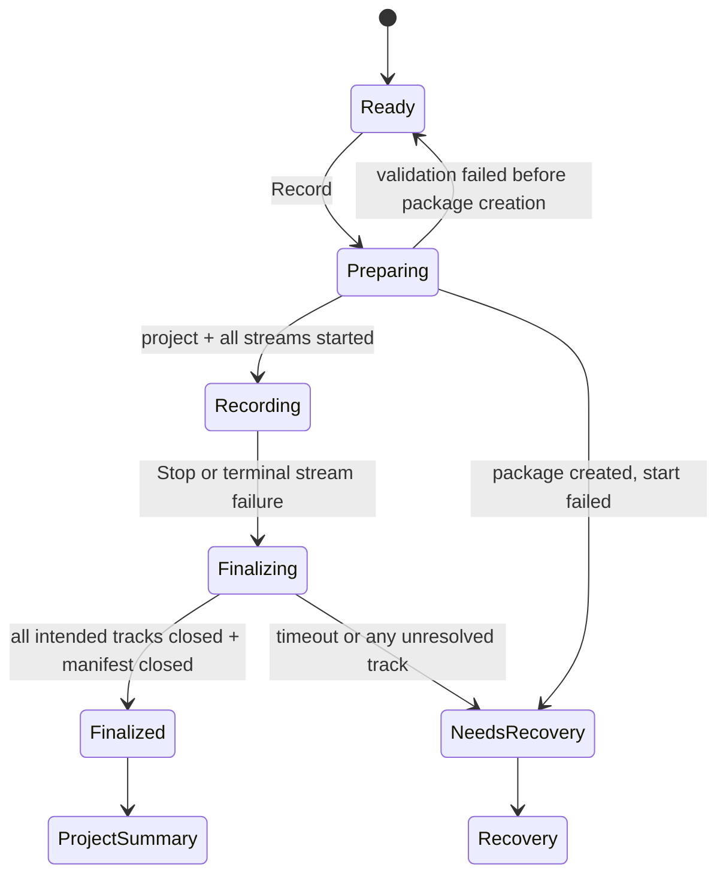

# Studio Recorder — implementation blueprint

Status: implementation source of truth for the approved design direction.

This document connects the existing ScreenCaptureKit foundation to every planned screen, setting, transition, persisted value, and verification point. It is intentionally stricter than the HTML prototype: a control may appear in SwiftUI only when its effect is implemented and testable.

## 1. Product decisions

1. The durable object is a `.recordingproject` **Project**, not a loose movie and not a UI session.
2. The main window has two permanent destinations: **Projects** and **Studio**.
3. **Recovery** is contextual and appears only while one or more projects need review.
4. **Settings** is a separate SwiftUI `Settings` scene opened by `⌘,`.
5. A **Studio Draft** is editable before capture. Starting capture freezes it into an immutable **Capture Request**.
6. The Capture Request is written into the project manifest before any stream starts.
7. Recording exposes health and Stop, not configuration.
8. Raw tracks are never modified by layout, transcript, or export operations.
9. The first shippable UI ends in **Project Summary**. Quick Edit and synchronized screen/camera program composition are implemented; waveform editing remains a later slice.
10. Current capture remains 30 fps by default. A 60 fps option stays unavailable until runtime capability tests and sustained multi-display tests exist.

## 2. Scope truth

| Capability | Existing code | First implementation wave | Later wave |
| --- | --- | --- | --- |
| Screen permission via ScreenCaptureKit | implicit through `SCShareableContent` | explicit diagnosis and repair flow | — |
| Microphone permission | requested by capture path | explicit status and repair flow | — |
| Multi-display raw recording | implemented | preserve and expose exact selected sources | — |
| System audio + microphone | embedded in primary display recording | selectable defaults, device/status visibility | isolated audio tracks if required |
| HEVC with H.264 fallback | implemented | expose as an honest automatic policy | additional codecs only with evidence |
| Native cursor capture | configurable per new session; click rings implemented | cursor/click telemetry plus frozen cursor treatment | custom enlarged-cursor and click-ring rendering |
| Project package + journal | implemented, schema v1 | schema v2 snapshot, typed events, v1 reader | edit/export metadata |
| Interrupted-project detection | implemented from `stoppedAt == nil` | per-track recovery report | segment repair tooling |
| Project library | implemented | package indexing, summary, raw-track playback | search, thumbnails, and richer metadata |
| Program compositor | implemented on playback/export | one Core Image render path for screen/camera layout and Quick Edit | capture-time pre-rendered program file only if evidence requires it |
| Camera isolation | implemented | optional permission-aware camera source, independent raw camera, and editable composed layout | program-only retention policy after durable program finalization |
| Camera background | implemented | local Vision Person segmentation or adjustable green/blue chroma key in Studio and Project composition | clean-plate matting only after a measured prototype |
| Canvas and screen region | foundation implemented | horizontal/vertical/16:10/square/custom canvas plus full/fixed/follow modes | fixed region affects ScreenCaptureKit raw capture; follow mode stays non-destructive until telemetry renderer |
| Transcript editing | not implemented | absent from MVP UI | Diduny job + token timeline |
| Quick share media | implemented | live composed Scene snapshot plus raw movie share/drag, current-frame PNG, bounded GIF | system-wide window/region screenshot picker and lightweight markup |
| Quick edit foundation | implemented | ordered source ranges, trim, split/delete, undo/redo/reset | synchronized tracks, waveform, speed and volume |
| Streaming | implemented foundation | same frozen scene into Record, YouTube Stream, or both; manual RTMPS key stays in Keychain | YouTube ingest soak, reconnect, then OAuth-managed broadcast creation |

## 3. Canonical data flow



### Source-of-truth rules

| Concern | Source of truth | Never derive it from |
| --- | --- | --- |
| Current permissions | live system query | previous launch or UserDefaults |
| Available displays/devices | live framework discovery | saved display names |
| Defaults for a new recording | `RecordingPreferences` | current view controls |
| Current preflight selection | `StudioDraft` | preferences after the draft is created |
| Active session configuration | immutable `CaptureRequest` | mutable settings or toggles |
| Project lifecycle | manifest + typed journal + file inspection | a single UI status flag |
| Recovery status | `RecoveryReport` generated from package contents | `stoppedAt == nil` alone |
| Project list | repository scan/index | coordinator runtime state |

## 4. Domain model

### Core terms

- **Project** — durable package containing manifest, journal, raw tracks, and later edit/export instructions.
- **Studio Draft** — mutable setup for the next session. It may be abandoned without creating files.
- **Capture Request** — validated, immutable snapshot used to create the project and streams.
- **Session** — runtime period from accepted Capture Request until all outputs finalize or interruption is recorded.
- **Source** — discoverable display, microphone, system-audio feed, or camera.
- **Track** — file-backed media output associated with one or more sources.
- **Capture Contract** — resolution policy, frame rate, codec policy, cursor/app exclusion, audio policy, and destination.
- **Project Status** — derived lifecycle: `recording`, `finalizing`, `finalized`, `needsRecovery`, or `unreadable`.
- **Recovery Report** — per-track evidence and allowed actions for an interrupted package.

### Planned value types

```swift
struct RecordingPreferences: Codable, Equatable, Sendable {
    var appearance: AppearancePreference
    var capture: CaptureDefaults
    var audio: AudioDefaults
    var storage: StorageDefaults
}

struct StudioDraft: Equatable {
    var selectedDisplayIDs: Set<UInt32>
    var capturesSystemAudio: Bool
    var capturesMicrophone: Bool
    var microphoneDeviceID: String?
    var includeCursor: Bool
    var excludeStudioRecorder: Bool
    var destination: URL
}

struct CaptureRequest: Codable, Equatable, Sendable {
    let id: UUID
    let createdAt: Date
    let displaySources: [DisplaySourceSnapshot]
    let audio: AudioCaptureSnapshot
    let profile: CaptureProfileSnapshot
    let destinationBookmarkID: String
}
```

`CaptureRequest` contains display names and dimensions as a historical snapshot, but stream creation resolves the live `SCDisplay` by ID immediately before starting. If a selected source disappeared, preparation fails before the first stream starts.

### Manifest v2

New packages add:

- immutable `captureRequest`;
- relative track descriptors and their intended contents;
- app/build version;
- schema version;
- created/stopped timestamps.

The reader must keep supporting schema v1 packages. Do not rewrite v1 packages during discovery. Decode them into the normalized in-memory project model with explicit `unknown` values for fields that did not exist.

### Typed journal events

Replace free-form string handling at read time with a versioned enum while preserving NDJSON:

- `projectCreated`
- `trackPrepared`
- `trackStarted`
- `trackFinished`
- `trackFailed`
- `finalizationStarted`
- `projectClosed`
- `projectInterrupted`

Every event has `timestamp`, optional `trackID`, and structured detail. Human-readable error copy is additional data, not the event type.

## 5. Application state and navigation

```swift
enum MainRoute: Hashable {
    case projects(selection: Project.ID?)
    case studio
    case recovery(selection: Project.ID?)
}

enum LaunchPhase: Equatable {
    case checking
    case needsCaptureRepair(PermissionSnapshot)
    case ready
}

enum CapturePhase: Equatable {
    case idle
    case preparing(PreparationProgress)
    case recording(RecordingSnapshot)
    case finalizing(FinalizationProgress)
    case completed(Project.ID)
    case failed(CaptureFailure)
}
```

### Launch flow



Permission diagnosis gates capture, not project access. Screen Recording is always required. Microphone access is required only when the current Studio Draft enables microphone capture. If permission is revoked after projects exist, the user can still browse Projects, Project Summary, Recovery, and Settings; Studio shows the relevant repair action instead of Record.

### Capture flow



Closing the main window never silently abandons an active session. During recording it asks whether to stop and close cleanly. During finalization it explains that tracks are closing and offers `Keep Window Open`; forced termination is handled by recovery on next launch.

## 6. Deep modules and seams

Avoid one view model per screen. Views render a single `StudioRecorderModel` snapshot and send intents back to it.

### `StudioRecorderModel` — application coordinator

Small interface:

- observable `snapshot` containing launch, route, library, studio, and recovery state;
- `send(AppIntent)` for user/system events.

It owns navigation and ordering, not capture or filesystem implementation.

### `PermissionCenter`

- `refresh() async -> PermissionSnapshot`
- `request(_ permission: CapturePermission) async`
- `openSystemSettings(for:)`

Screen capture and audio/video permissions are reported separately. It refreshes when `NSApplication.didBecomeActiveNotification` fires.

### `ProjectLibrary`

Evolves `RecordingProjectStore` into the deep filesystem module:

- discover and normalize v1/v2 packages;
- create a package from a Capture Request;
- append typed journal events;
- close or mark interrupted;
- build project and recovery snapshots;
- discard only after explicit confirmation.

Keep `FileManager`, encoders, package layout, migration, and file inspection behind this module. A temporary base directory remains injectable for tests; do not add a protocol until a second real adapter exists.

### `CaptureSessionController`

Evolves `RecordingCoordinator`:

- `refreshSources()`
- `start(_ request: CaptureRequest)`
- `stop()`
- observable `CaptureSnapshot` with source and finalization health.

It owns ScreenCaptureKit streams, output delegates, duration, health telemetry, and teardown. It never decides navigation.

### `PreferencesStore`

- validated `preferences` value;
- atomic updates;
- a factory that creates a new `StudioDraft` from current defaults and live sources.

Use UserDefaults for scalar preferences. Persist a selected destination as a bookmark plus a human-readable fallback path. If the bookmark fails, fall back to `~/Movies/Studio Recorder` and show a Storage warning.

### Editing seams

`ProjectEditTimeline`, `ProjectEditStore`, `ProjectEditRenderer`, and `ProjectProgramRenderer` form the bounded edit seam. They persist one program timeline plus layout in `edit.json`, replay recorded Follow Cursor telemetry, render moving screen/camera playback, and export MOV/PNG/GIF derivatives without mutating raw tracks. `TranscriptionClient`, custom cursor/click rendering, waveforms, speed, and volume remain later seams.

## 7. Screen contracts

### 7.1 Permission diagnosis

**Entry:** Screen Recording is not usable, or microphone access is not usable while the current Studio Draft enables microphone capture.

**Reads:** live `PermissionSnapshot`; app-active events.

**States:** checking skeleton, not determined, denied, granted-but-relaunch-required, unavailable/error.

**Actions:**

- `Allow Microphone` requests access only when status is `notDetermined`;
- `Record Without Microphone` turns microphone capture off in the current draft; it does not silently change the saved default;
- `Open System Settings` deep-links to the relevant Privacy & Security pane for denied access;
- `Check Again` performs a fresh query;
- `Browse Existing Projects` remains available.

Camera is optional and permission-aware. When enabled, its selected device is frozen into the Capture Request and recorded as an independent fragmented movie. A user can disable it for only the current draft. Microphone denial never blocks a screen-only draft.

**Exit:** when required permissions are valid, return to the intended route and refresh sources. No fixed timer and no indefinite “Checking…”.

**Acceptance:** revoking Screen Recording removes Record on the next app activation. Revoking microphone access removes Record only while microphone capture is enabled in the draft. Existing projects remain browsable in both cases.

### 7.2 Projects

**Entry:** default route after successful launch or completed indexing.

**Reads:** `ProjectLibrarySnapshot`, recovery count, destination free space.

**States:** loading skeleton, empty library, populated library, search results, unreadable package, contextual recovery banner.

**Actions:** `New Recording` (`⌘N`), open project, search (`⌘F`), reveal in Finder, review recovery, sort by created date.

**Rules:**

- feature the most recent finalized/recovered project;
- use editorial rows for the rest;
- search only indexed project name/date/source metadata;
- show Recovery destination only when the recovery count is greater than zero;
- an unreadable package is listed with a diagnostic state, never silently omitted.

**Exit:** New Recording creates a fresh Studio Draft; selecting a project opens Project Summary; recovery banner opens the selected Recovery report.

### 7.3 Project Summary — first shippable post-capture screen

**Purpose:** close the journey with immediate sharing plus a bounded Quick Edit surface.

**Reads:** normalized project, track descriptors, file sizes/durations, lifecycle, last journal events.

**Shows:** project name, creation/duration/profile, each raw track and finalization state, package location, capture contract.

**Actions:** play the moving composed program, select the program screen source, independently resize/place/shape/mirror screen and camera, persist non-destructive trim/split/delete decisions, undo/redo/reset, export an edited MOV, reveal the package, open/share/drag a selected raw movie, save the composed playhead frame as PNG, create a bounded five-second GIF, and return to Projects. Every edit/share file is derived; raw tracks remain unchanged. Rename is allowed only after package-safe rename logic is implemented.

**Not shown yet:** synchronized waveforms, arbitrary selected export range, speed/volume, editable cursor keyframes, transcript editing, or a program-only retention policy.

The route remains `.projects(selection: id)`, so Project Summary can later be replaced by the Editor without changing library or recovery navigation.

### 7.4 Studio — ready

**Entry:** `New Recording` or Studio navigation with no active session.

**Reads:** `StudioDraft`, live sources, permission snapshot, disk capacity, current input level.

**Must answer:** what is captured, what is heard, where files go, and whether capture is safe to start.

**Editable:** selected displays, system audio, microphone, microphone device, cursor inclusion, app exclusion. Changes affect only this draft.

**Derived validation:**

- at least one current display selected;
- required permissions available;
- selected microphone still exists when microphone capture is on;
- destination reachable and writable;
- estimated headroom above the hard safety threshold;
- no other session active.

**Record:** enabled only when validation has no blocking issues. Pressing `⌘R` sends one `startDraft` intent; repeated presses during preparation are ignored.

**Preview:** current wave shows an honest source/stage preview. Layout controls that do not affect recorded files are absent.

### 7.5 Studio — preparing

Same geometry as Ready. Freeze the draft and show ordered progress:

1. validate live sources and destination;
2. create package and write manifest;
3. prepare track outputs;
4. start streams;
5. confirm every intended output started.

Cancel is available only before any stream starts. A failure before package creation returns to Ready with an inline fix. A failure after package creation writes interruption evidence and routes to Recovery.

### 7.6 Studio — recording

**Reads:** immutable Capture Request and live `RecordingSnapshot`.

**Shows:** timer, source/track health, audio activity, dropped frames when measurable, disk headroom, journal heartbeat, destination, and one Stop action.

**Locked:** all source, audio, destination, codec, cursor, and profile controls.

**Actions:** Stop (`⌘R`) exactly once. No pause until pause semantics exist across files and recovery.

**Failure:** a terminal output failure immediately begins shared teardown; UI stays in project context and transitions to Finalizing, then Recovery.

### 7.7 Finalizing

**Reads:** per-track finalization progress published by `CaptureSessionController`.

**Shows:** last preview frame, elapsed duration, each intended track as waiting/finalized/failed/timed out, explanatory copy.

**Success condition:** every started output reports finish, required files pass basic AV asset inspection, manifest receives `stoppedAt`, and `projectClosed` is appended.

**Exit:** success opens Project Summary; any unresolved track builds a Recovery Report and opens Recovery. The current fixed five-second timeout becomes a named policy with test coverage and visible failure context.

### 7.8 Recovery

**Entry:** contextual navigation, project banner, failed preparation/finalization, or launch scan.

**Layout:** interrupted project list + selected report detail.

**Reads:** manifest, journal, expected track descriptors, file existence, basic media readability and duration.

**Track states:** finalized, partial/readable, missing, unreadable, unknown-v1.

**Actions:**

- `Open Recovered Project` marks the review resolved without pretending missing media was restored;
- `Show Package`;
- `Discard Package` as a confirmed destructive action.

Recovery disappears from navigation only when no unresolved reports remain. “Resolved” must be persisted as project metadata/journal evidence, not an in-memory dismissed banner.

### 7.9 Settings window

Use SwiftUI `Settings { SettingsView() }`. The window is independent of main navigation and remembers its selected tab.

#### General

| Setting | Values | Default | Applies |
| --- | --- | --- | --- |
| Appearance | System, Light, Dark | System | immediately; UI only |

Do not add launch behavior or automatic deletion until a real product need exists.

#### Capture

| Setting | Values | Default | Current effect |
| --- | --- | --- | --- |
| Frame rate | 30 fps | 30 fps | copied into next draft/request |
| Codec policy | Automatic HEVC → H.264, H.264 | Automatic | copied into next draft/request |
| Include cursor | On/Off | On | copied into next draft/request |
| Exclude Studio Recorder | On/Off | On | copied into next draft/request |
| Program resolution | 1920×1080 target | 1920×1080 | read-only `Next slice`; raw tracks stay native |
| Follow cursor between displays | On/Off | On | hidden/disabled until compositor exists |

60 fps must not appear as selectable until capability gating and multi-display soak tests pass.

#### Audio

| Setting | Values | Default | Applies |
| --- | --- | --- | --- |
| Capture system audio | On/Off | On | next draft/request |
| Capture microphone | On/Off | On | next draft/request |
| Default microphone | discovered device IDs | system default | next draft; missing device falls back visibly |
| Exclude app audio | On/Off | On | next draft/request |

Show a live input level only while the Settings window is active. Do not add software gain or monitoring until the audio pipeline owns those behaviors.

#### Storage

| Setting | Values | Default | Applies |
| --- | --- | --- | --- |
| Save new projects to | writable folder bookmark | `~/Movies/Studio Recorder` | next draft/request |

Show resolved path, free space, reveal action, and bookmark/writeability warnings. Existing projects never move when this setting changes. No automatic cleanup.

#### Shortcuts

First wave is a read-only discoverability list:

- `⌘N` New Recording
- `⌘R` Record / Stop in Studio
- `⌘F` Search Projects
- `⌘,` Settings
- `Esc` dismiss sheet/dialog
- `Space` play/pause and `⌘E` Export only after Editor/Export ships

Do not build a shortcut recorder in this wave.

#### Settings locking policy

- Appearance remains editable during recording.
- Capture, Audio, and Storage controls are disabled from Preparing through Finalizing with “Applies to new sessions; locked while recording.”
- Settings values are never consulted by an active session; the Capture Request is authoritative.
- After the session finishes, the next new draft clones the latest saved defaults.

### 7.10 Editor — Quick Edit and program composition foundation

Entry requires a finalized or explicitly recovered project. The implemented foundation reads one selected screen as the program timing source, composes optional camera layout, replays recorded cursor framing, and renders persisted ordered ranges for playback/export. Future editable cursor/camera keyframes, transcript cuts, waveforms, speed, volume, and richer Export continue to operate on derived instructions/output only.

## 8. Intent and transition matrix

| Intent | Allowed from | Writes | Destination |
| --- | --- | --- | --- |
| New Recording | Projects, Project Summary | new Studio Draft | Studio Ready |
| Change source/default override | Studio Ready | Studio Draft | Studio Ready |
| Record | Studio Ready + valid draft | Capture Request, manifest, journal | Preparing → Recording |
| Stop | Recording | journal/finalization state | Finalizing |
| Capture completed | Finalizing | closed manifest + journal | Project Summary |
| Capture interrupted | Preparing/Recording/Finalizing | interrupted event/report | Recovery |
| Open Project | Projects/Recovery | route selection only | Project Summary |
| Change preference | Settings | Preferences Store | current tab; next draft unless appearance |
| App became active | any | live permission/source snapshot | same route or permission repair |

## 9. Delivery plan

Each slice is independently buildable and testable. Do not start the next slice with failing tests.

### Slice 0 — protect the existing foundation

- add fixture coverage for schema v1 package discovery;
- capture current coordinator state tests around start/stop/failure;
- name current timeout and capture-profile policies;
- keep the existing UI usable during refactoring.

**Done:** current tests pass; a v1 package is still discovered and closed correctly.

### Slice 1 — normalized project model and library module

- add manifest v2 and version-aware decoding;
- add typed journal events;
- implement normalized project/recovery snapshots;
- scan packages without blocking the main actor.

**Done:** v1/v2 fixtures produce deterministic list and recovery results.

### Slice 2 — application model and shell

- add `StudioRecorderModel`, `AppIntent`, route and launch state;
- replace the current `record/layouts/recovery` peer navigation with Projects/Studio/contextual Recovery;
- add command routing for `⌘N`, `⌘R`, `⌘F`.

**Done:** navigation tests prove every route precondition and no command starts duplicate work.

### Slice 3 — permission diagnosis

- implement `PermissionCenter`;
- add app-activation refresh;
- build diagnosis/repair screen and accessible status rows;
- keep project browsing available while capture is blocked.

**Done:** not-determined, denied, granted, revoked, relaunch-required, and framework-error states have deterministic UI tests.

### Slice 4 — Preferences and Studio Draft

- add Settings scene and validated `PreferencesStore`;
- implement Capture, Audio, Storage, General and Shortcuts tabs as contracted above;
- create drafts from defaults + current sources;
- persist destination bookmark and safe fallback.

**Done:** settings propagation tests prove active Capture Requests cannot change.

### Slice 5 — Projects and Project Summary

- implement loading, empty, populated, search, unreadable, and recovery-banner states;
- implement project selection and honest Project Summary;
- add Finder reveal and raw-track open actions.

**Done:** a real temporary package appears, searches, opens, and retains its lifecycle after relaunch.

### Slice 6 — Studio Ready and Preparing

- rebuild stage + inspector + control deck;
- expose live sources, audio confidence, destination and validation;
- convert a validated draft into one Capture Request;
- publish ordered preparation progress.

**Done:** Record is impossible for every invalid draft; after acceptance the UI cannot mutate the request.

### Slice 7 — Recording health and Finalizing

- publish per-source health and per-track output lifecycle;
- preserve one teardown path for Stop and failures;
- show Recording and Finalizing states without changing geometry;
- inspect outputs before closing the manifest.

**Done:** start, stop, partial start, delegate failure, timeout, and forced-close paths end in exactly one finalized project or one recovery report.

### Slice 10 — Camera Program Canvas and Output Profiles

Begin only after the Studio Draft, preparation, and recording-health slices provide immutable capture requests and source lifecycle evidence.

- write a composed program movie while preserving independent raw screen and camera tracks;
- edit the pre-recording camera overlay directly on the live canvas, with inspector controls for position, size, rectangle/rounded-rectangle/circle shape, and corner radius;
- freeze the selected layout and profile into the Capture Request when recording begins;
- offer 16:9 (1920×1080, 2560×1440, 3840×2160), 16:10 (1920×1200, 2560×1600, 3840×2400), and 4:3 (1440×1080, 1920×1440, 2880×2160) program profiles;
- record both requested and effective profiles; preflight automatically selects the nearest lower quality in the same aspect ratio when required;
- continue with a visible degraded program and journal evidence if the optional camera or microphone fails; stop safely into Recovery if a required screen fails.

**Done:** live pre-record layout changes are reflected in the composed output, the immutable request records requested/effective profile and layout, optional-source loss remains inspectable, and required-screen loss ends in Recovery without corrupting raw media.

**Current foundation (2026-07-15):** canvas size/aspect, fixed region, screen/camera shape and placement, cursor treatment, and click emphasis are modeled, tested, editable in the native preflight UI, and frozen into the Capture Request. Fixed region is connected to ScreenCaptureKit. Follow Cursor records a cursor/click timeline beside the raw tracks and replays it through the Core Image compositor in Project playback plus MOV/PNG/GIF export. Project detail seeds a draggable layout from the request and persists later canvas/source edits in schema-v2 `edit.json` without modifying raw tracks. Custom cursor sizing/click-ring rendering remains before this slice meets its full Done condition.

### Slice 11 — Non-destructive Quick Edit foundation

- persist a versioned `edit.json` beside the manifest and journal;
- represent the edited movie as ordered source ranges without rewriting raw tracks;
- implement trim-before/after, split, segment delete, undo/redo, and reset;
- use the same edit timeline for native playback, PNG/GIF derivation, and compatible MOV export;
- keep synchronized waveforms, speed, and volume as explicit next work.

**Done:** edit decisions survive relaunch, raw bytes remain unchanged, edited playback/export use the same ordered ranges, and renderer tests prove deleted source ranges are absent from the compatible movie.

### Slice 12 — Camera background treatment

- use one background mode in the frozen stage: `Off`, `Person`, `Green Screen`, or later `Studio Plate`;
- implement `Person` locally with a reused Vision person-segmentation request; never promise that it retains microphones or other equipment;
- implement `Green Screen` with Core Image chroma key, tolerance, edge softness, and spill control so non-key-colored microphones and stands remain;
- prototype `Studio Plate` only after capturing a clean background reference and benchmarking foreground matting on Apple Silicon;
- apply the same mask before camera placement/shape/mirroring in live preview, local program output, and stream output;
- keep the independent raw camera unchanged when editable-source retention is selected.

**Done:** live preview and exported program agree frame-for-frame, Person mode degrades safely when Vision cannot produce a mask, Green Screen retains a foreground microphone in the fixture test, and no camera pixels leave the Mac solely for background processing.

**Current foundation (2026-07-15):** `Off`, local Vision `Person`, and adjustable green/blue `Green Screen` are frozen with the scene, shown in Studio, editable in Project, and applied before camera placement/shape/mirroring by the shared Core Image program compositor. Person preview downsamples and throttles the segmentation input so 4K Continuity Camera does not starve capture. Independent raw camera media remains unchanged.

### Slice 13 — Shared Record and YouTube output pipeline

- make one `LiveProgramPipeline` own synchronized timestamps, stage layout, screen framing/follow, camera shape/background, cursor/click rendering, and audio mix;
- fan the same program samples into `Record`, `Stream`, or `Record + Stream` sinks; streaming failure never stops a healthy local recording;
- ship manual YouTube RTMPS server URL + stream key first, with the key stored only in Keychain and excluded from project JSON/logs;
- use H.264/AAC with a two-second keyframe interval; default 1080p30 to 10 Mbps and keep vertical 1080×1920 as a first-class stage;
- isolate the RTMP dependency behind `YouTubeStreamSink`; pin and verify only the HaishinKit and RTMPHaishinKit products before adding them;
- add OAuth/API-managed broadcast creation later without changing the media pipeline.

**Done:** an unlisted 60-minute 1920×1080 and 1080×1920 soak test stays synchronized, Record + Stream survives network loss without losing the local recording, reconnect state is visible, and YouTube ingest screenshots match the saved stage.

**Current foundation (2026-07-15):** Studio exposes `Record`, `Stream`, and `Record + Stream`. The live ScreenCaptureKit/AVCaptureSession Scene feeds the same `ProgramFrameCompositor` used by Project playback/export, then a pinned HaishinKit 2.2.5 manual mixer encodes H.264/AAC into RTMPS. The key is stored only in Keychain. Tests prove exact composed canvas delivery and closed failure on an unavailable endpoint; real YouTube ingest and 60-minute horizontal/vertical soak acceptance still require a user stream key and live control-room verification.

### Slice 8 — Recovery resolution

- build evidence-based per-track reports;
- persist resolved state;
- implement open/reveal/confirmed-discard;
- remove contextual navigation when the unresolved count reaches zero.

**Done:** recovery actions survive relaunch and never alter raw media silently.

### Slice 9 — product hardening

- light/dark/System appearance;
- 1080×700 minimum-window checks and inspector collapse behavior;
- VoiceOver labels/order, keyboard-only navigation, Reduce Motion;
- long localized copy and long device/path names;
- multi-display and low-disk manual soak runs using DEV app permissions.

**Done:** verification matrix below is green and the README truth table matches shipping behavior.

## 10. Verification matrix

| Layer | Required coverage |
| --- | --- |
| Domain unit | draft validation, capture-request freezing, project status derivation, recovery classification, schema migration |
| Module unit | preferences fallback/bookmark, project scan/create/journal/close, permission mapping, teardown idempotency |
| Coordinator integration | partial stream start, output delegate order, timeout, failure while stopping, app termination |
| View state | every loading/empty/error/ready/locked state with stable snapshots |
| Navigation | command and button transitions, contextual Recovery visibility, blocked Studio with browsable Projects |
| Filesystem | v1/v2 fixtures, missing manifest, corrupt journal line, missing/partial/unreadable track, unwritable destination |
| Accessibility | VoiceOver names, focus order, keyboard operation, non-color status indicators, Reduce Motion |
| Visual | 1440×900 and 1080×700, dark/light, long paths/device names, no horizontal scroll |
| Manual capture | one/two displays, mic on/off, system audio on/off, permission revoke, low disk, forced quit, clean stop |

## 11. Definition of connected

The implementation is connected only when all of these are true:

- every visible value names its source of truth;
- every action names its allowed states and next state;
- every setting names when it applies and whether it is frozen;
- every package can be reopened after app relaunch without runtime memory;
- every failure after package creation produces inspectable recovery evidence;
- Projects, Studio, Finalizing, Recovery, and Project Summary show the same Project ID and lifecycle;
- no future-only control looks enabled;
- README, tests, manifest schema, and UI claims agree.

## 12. Implementation references

- Apple: [ScreenCaptureKit](https://developer.apple.com/documentation/screencapturekit)
- Apple: [Capturing screen content in macOS](https://developer.apple.com/documentation/screencapturekit/capturing-screen-content-in-macos)
- Apple: [AVCaptureDevice authorization](https://developer.apple.com/documentation/avfoundation/avcapturedevice/authorizationstatus(for:))
- Apple: [SwiftUI Settings scene](https://developer.apple.com/documentation/swiftui/settings)
- Apple: [SwiftUI menus and commands](https://developer.apple.com/documentation/swiftui/menus-and-commands)
