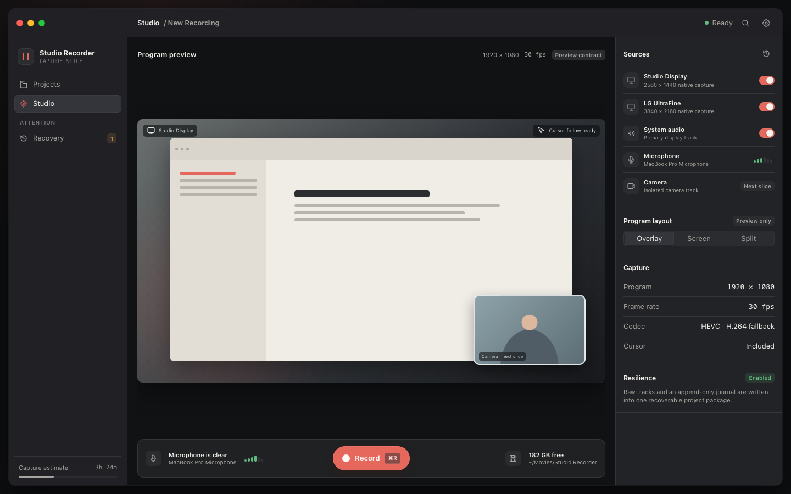
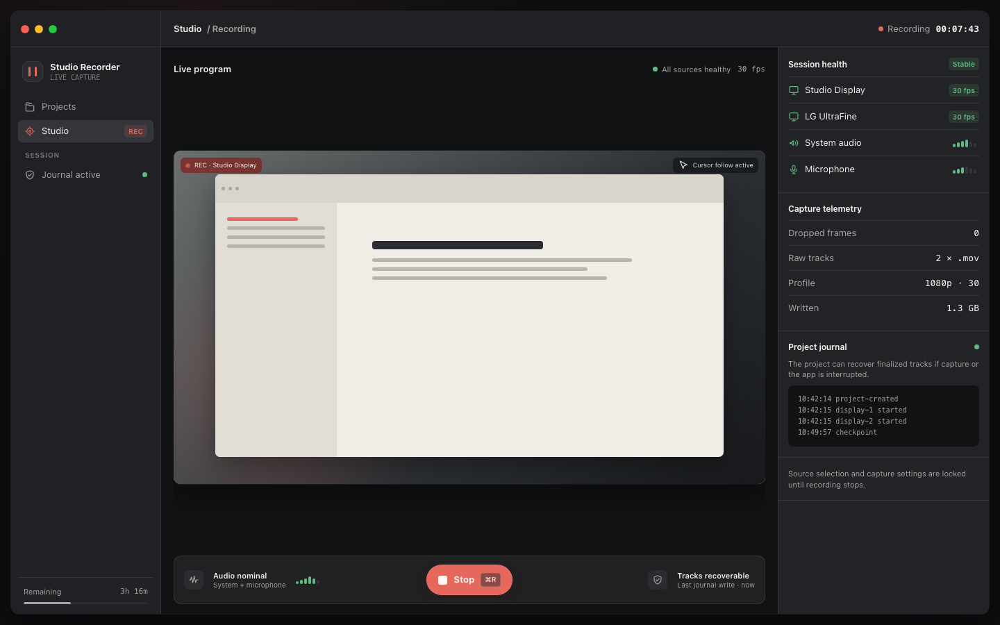
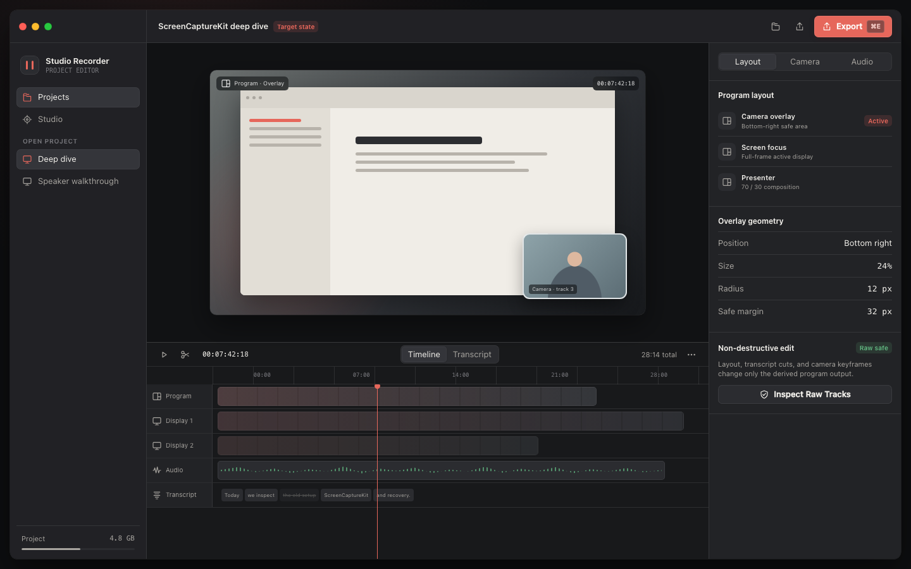

# Studio Recorder design package

This folder describes a coherent native macOS product before the SwiftUI shell is rebuilt.

## Open the prototype

Start with [`prototype/index.html`](prototype/index.html). The prototype is static and has no build step:

```bash
open design/prototype/index.html
```

The screen links form one product journey:

1. [`onboarding.html`](prototype/onboarding.html) — permission diagnosis and first launch
2. [`index.html`](prototype/index.html) — project library and home
3. [`studio-ready.html`](prototype/studio-ready.html) — capture setup
4. [`studio-recording.html`](prototype/studio-recording.html) — live recording health
5. [`editor.html`](prototype/editor.html) — target-state non-destructive editor
6. [`recovery.html`](prototype/recovery.html) — interrupted project review
7. [`settings.html`](prototype/settings.html) — capture, audio, storage, and shortcuts

Use `⌘R` on the Studio prototype to move between ready, recording, and project states.

## Source-of-truth files

- [`DESIGN.md`](DESIGN.md) — Google Stitch-ready semantic design system
- [`APP_FLOW.md`](APP_FLOW.md) — product model, navigation, states, and implementation boundary
- [`IMPLEMENTATION_BLUEPRINT.md`](IMPLEMENTATION_BLUEPRINT.md) — screen-by-screen contracts, settings propagation, module seams, delivery slices, and verification matrix
- [`STITCH_PROMPTS.md`](STITCH_PROMPTS.md) — ready-to-paste prompts for generating the same screens in Google Stitch

## Important boundary

The prototype is a product-direction artifact, not proof that every control is implemented.

- **Implemented foundation:** display discovery, multi-display raw capture, system audio and microphone, 30 fps, project packages, append-only journal, and interrupted-project discovery.
- **Target-state design:** camera isolation, composited program output, timeline editing, transcript cuts, exports, and streaming.

The UI labels future-only controls as `Next slice` or `Target state` where that distinction matters.

## Rendered previews

The checked-in previews were rendered from the HTML at 1440 × 900 px.






